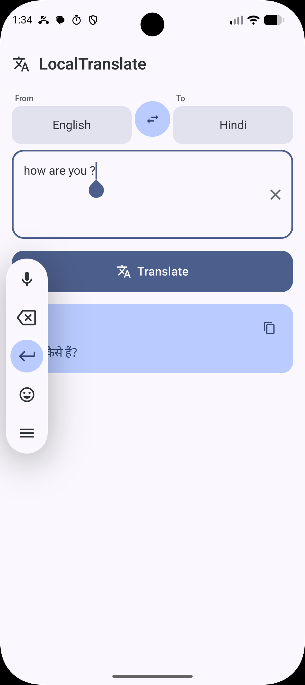
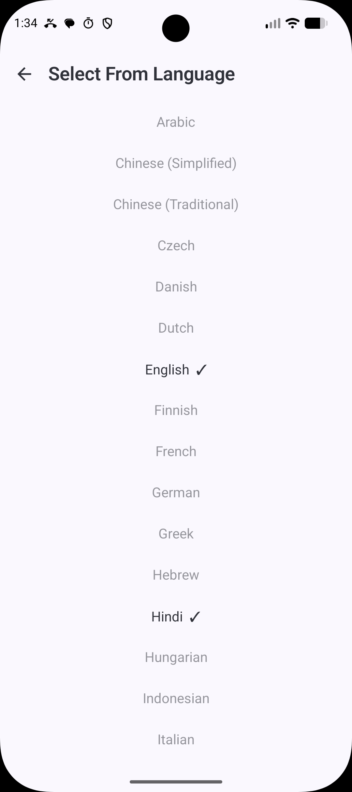

<div align="center">
  
  <h1>LocalLayer</h1>
  <p><strong>On-device text translation · Powered by ML Kit</strong></p>
  <p>
    <a href="#features"></a>
    <a href="#tech-stack"></a>
    <a href="https://kotlinlang.org"></a>
    <a href="https://developer.android.com/jetpack/compose"></a>
    <a href="LICENSE"></a>
    <a href="https://github.com/features/actions"></a>
  </p>
</div>

---

**LocalLayer** is a fully offline, on-device translation app for Android that uses **ML Kit Translate API** to translate text between 30+ languages — no cloud calls, no API keys, no internet required. Every translation stays on your device.

---

## ✨ Features

- **🔒 100% Private** — All translation runs locally. Zero data leaves your device.
- **📴 No Internet Required** — Works completely offline once language models are downloaded.
- **🌐 30+ Languages** — Translate between English, French, German, Japanese, Hindi, Arabic, and many more.
- **🎨 Material Design 3** — Modern UI with dynamic color (Material You) support.
- **📱 Jetpack Compose** — Declarative, reactive UI built entirely with Compose.
- **⬇️ Auto Model Download** — Language models download automatically on first use (≈30MB per pair).
- **⚡ Instant Swap** — Swap source and target languages with one tap.
- **📋 One-Tap Copy** — Copy translated text to clipboard with haptic feedback.
- **🌙 Dark Mode** — Automatic theme switching based on system settings.
- **🆓 Free & Open Source** — No subscriptions, no API costs, forever.

## 🖼️ Screenshots

| Language Setup | Main Screen | Translation Result |
|:---:|:---:|:---:|
|  |  |  |

## 🛠️ Tech Stack

| Layer | Technology |
|---|---|
| **Language** | [Kotlin](https://kotlinlang.org) 2.0.21 |
| **UI Framework** | [Jetpack Compose](https://developer.android.com/jetpack/compose) with Material Design 3 |
| **Theming** | Dynamic Color (Material You) via `MaterialTheme.colorScheme` |
| **Architecture** | Single Activity + `ViewModel` + `StateFlow` |
| **Translation Engine** | [ML Kit Translate API](https://developers.google.com/ml-kit/language/translation/android) `17.0.3` |
| **On-Device Model** | ML Kit language packs (≈30MB per language pair) |
| **Min SDK** | API 26 (Android 8.0) |
| **Target SDK** | API 35 (Android 15) |
| **Build System** | Gradle 8.9 + Android Gradle Plugin 8.7.3 |
| **CI/CD** | GitHub Actions — automated APK build & release |

## 📦 Installation

### Prerequisites

- Android device running Android 8.0+
- Internet connection for first-time model download (Wi-Fi recommended)

### Download APK

1. Go to the [Releases](https://github.com/yourusername/locallayer/releases) page.
2. Download the latest `app-debug.apk`.
3. Open it on your device to install.

### Build from Source

```bash
git clone https://github.com/yourusername/locallayer.git
cd locallayer
./gradlew assembleDebug
```

The APK will be at `app/build/outputs/apk/debug/app-debug.apk`.

## 🚀 Usage

1. Open **LocalLayer** on your device.
2. Select your source and target languages using the dropdowns.
3. Type or paste text in the input field.
4. Tap **Translate** — the language model downloads automatically on first use.
5. View the translation result and tap the copy icon to copy it to your clipboard.
6. Use the swap button (↔) to quickly reverse the language direction.

## 🤖 How It Works

```
┌───────────────────────────────────────────────────┐
│                   Your Android Device               │
│                                                     │
│  ┌──────────────┐     ┌─────────────────────────┐  │
│  │ LocalLayer│────▶│  ML Kit Translate API    │  │
│  │ (Compose UI)  │◀────│  (com.google.mlkit)     │  │
│  └──────────────┘     └──────────┬──────────────┘  │
│                                  │                  │
│                         ┌────────▼─────────────┐   │
│                         │  Language Packs       │   │
│                         │  (English, French,    │   │
│                         │   German, Japanese,   │   │
│                         │   Hindi, ...)         │   │
│                         └──────────────────────┘   │
│                                                     │
│  ──── No Internet · No API Calls · No Cloud ────   │
└───────────────────────────────────────────────────┘
```

## 📱 Supported Languages

| Code | Language | Code | Language |
|:---:|---|:---:|---|
| `ar` | Arabic | `ms` | Malay |
| `zh` | Chinese (Simplified) | `nb` | Norwegian |
| `zh-TW` | Chinese (Traditional) | `pl` | Polish |
| `cs` | Czech | `pt` | Portuguese |
| `da` | Danish | `ro` | Romanian |
| `nl` | Dutch | `ru` | Russian |
| `en` | English | `es` | Spanish |
| `fi` | Finnish | `sv` | Swedish |
| `fr` | French | `th` | Thai |
| `de` | German | `tr` | Turkish |
| `el` | Greek | `uk` | Ukrainian |
| `he` | Hebrew | `vi` | Vietnamese |
| `hi` | Hindi | | |
| `hu` | Hungarian | | |
| `id` | Indonesian | | |
| `it` | Italian | | |
| `ja` | Japanese | | |
| `ko` | Korean | | |

## 🏗️ Project Structure

```
locallayer/
├── app/
│   ├── src/main/
│   │   ├── java/com/locallayer/app/
│   │   │   ├── MainActivity.kt          # Compose UI — language selectors, input, result
│   │   │   ├── TranslateViewModel.kt    # ML Kit translation, model download, state
│   │   │   └── ui/theme/
│   │   │       ├── Theme.kt             # Material 3 theme (light/dark/dynamic)
│   │   │       ├── Color.kt             # Custom color definitions
│   │   │       └── Type.kt              # Typography scale
│   │   ├── AndroidManifest.xml
│   │   └── res/
│   ├── build.gradle.kts
│   └── proguard-rules.pro
├── docs/
│   └── index.html                       # Project landing page
├── .github/workflows/
│   └── release.yml                      # CI/CD pipeline for APK
├── build.gradle.kts                     # Root build config
├── settings.gradle.kts
├── gradle.properties
└── README.md
```

## 🤝 Contributing

Contributions are welcome! Here's how you can help:

1. Fork the repository.
2. Create a feature branch (`git checkout -b feature/amazing-feature`).
3. Commit your changes (`git commit -m 'Add amazing feature'`).
4. Push to the branch (`git push origin feature/amazing-feature`).
5. Open a Pull Request.

Please ensure your code follows the existing style and passes the build.

## 🚢 How to Release

Creating a new release is a **two-step** process:

### Step 1 — Bump the version

Edit `app/build.gradle.kts` and update the `versionName`:

```kotlin
defaultConfig {
    versionCode = 2          // increment for each release
    versionName = "1.1.0"    // update to the new version
}
```

### Step 2 — Commit with `#go`

Commit your changes with a message that **must contain `#go`** anywhere in the commit text:

```bash
git add .
git commit -m "feat: add Hindi support #go"
git push origin main
```

The CI/CD pipeline will automatically:
1. Detect `#go` in the commit message.
2. Read the version from `app/build.gradle.kts`.
3. Build the debug APK.
4. Create a Git tag (`v1.1.0`).
5. Publish a GitHub Release with the APK attached.

> **Note:** No keystore signing is required — the debug APK is released as-is. This is fine for open-source projects. Users install it as a debug build.

## 📄 License

This project is licensed under the **MIT License** — see the [LICENSE](LICENSE) file for details.

```
MIT License

Copyright (c) 2025 LocalLayer Contributors

Permission is hereby granted, free of charge, to any person obtaining a copy
of this software and associated documentation files (the "Software"), to deal
in the Software without restriction, including without limitation the rights
to use, copy, modify, merge, publish, distribute, sublicense, and/or sell
copies of the Software, and to permit persons to whom the Software is
furnished to do so, subject to the following conditions:

The above copyright notice and this permission notice shall be included in all
copies or substantial portions of the Software.

THE SOFTWARE IS PROVIDED "AS IS", WITHOUT WARRANTY OF ANY KIND, EXPRESS OR
IMPLIED, INCLUDING BUT NOT LIMITED TO THE WARRANTIES OF MERCHANTABILITY,
FITNESS FOR A PARTICULAR PURPOSE AND NONINFRINGEMENT. IN NO EVENT SHALL THE
AUTHORS OR COPYRIGHT HOLDERS BE LIABLE FOR ANY CLAIM, DAMAGES OR OTHER
LIABILITY, WHETHER IN AN ACTION OF CONTRACT, TORT OR OTHERWISE, ARISING FROM,
OUT OF OR IN CONNECTION WITH THE SOFTWARE OR THE USE OR OTHER DEALINGS IN THE
SOFTWARE.
```
